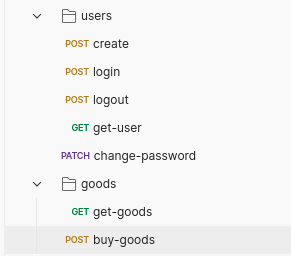

# Demo Node.js application

## Stack

- Express.js
- Postgres.js
- IORedis

## Dependencies

- Redis
- PostrgeSQL

## Tasks

1. Registration & login via username/password & authentication
2. Getting, filtering and transform items from API https://api.skinport.com/v1/items
3. The purchase of item

## Build & start

```
 copy .env.example .env // and fill environments
 yarn build
 yarn start
```

## Postman 
The last version of postman collection with demo of API requests is in .infra/postman_collection.json




